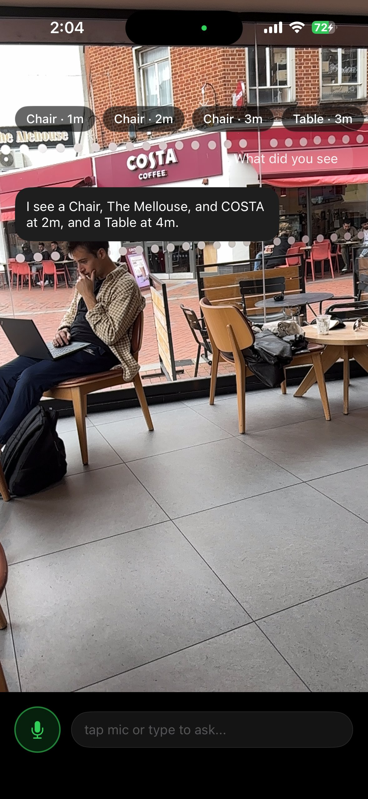

# SpatialKit

**Indoor Spatial AI Navigation SDK for iOS**

SpatialKit is a production-grade iOS SDK that fuses ARKit visual-inertial odometry, real-time YOLOv8n object detection, monocular depth estimation, and a Gemini AI agent layer to deliver semantic indoor navigation — entirely on-device.

> Real-world tested at Costa Coffee, Reading, UK.

---

## Demo

### Indoor AR Navigation
<p align="center">
  
</p>

*AR directional arrow with live semantic distance labels (Houseplant · 2m, Chair · 5m, Flowerpot · 5m) and turn-by-turn navigation prompt → Houseplant · 4m*

---

### Real-World Street Test — Costa Coffee, Reading
<p align="center">
  
</p>

*Gemini agent responding: "I see a Chair, The Mellouse, and COSTA at 2m, and a Table at 4m." — YOLO detections fused with OCR-read signage in a live outdoor environment.*

---

### Navigation Video

> 📹 **[Video demo — drop your MP4/GIF here]**
> Place your video file at `assets/demo.gif` (convert from MP4 via `ffmpeg -i demo.mp4 -vf fps=10,scale=320:-1 demo.gif`) and update this section.

---

## Architecture

```
┌─────────────────────────────────────────────────┐
│                   Swift Public API               │
├─────────────────────────────────────────────────┤
│              ObjC++ Bridge Layer                 │
├──────────────┬──────────────┬───────────────────┤
│  C++ EKF /   │  YOLOv8n     │  Depth Anything   │
│  SLAM Core   │  CoreML      │  V2               │
├──────────────┴──────────────┴───────────────────┤
│            ARKit VIO (Visual-Inertial)           │
├─────────────────────────────────────────────────┤
│         Gemini Agent Layer (Scene QA)            │
└─────────────────────────────────────────────────┘
```

The C++ core is platform-agnostic. iOS is purely a display and sensor layer. All state estimation, fusion, and landmark management runs in C++, bridged to Swift via ObjC++.

---

## Key Features

### 🧭 EKF/SLAM State Estimation
- Extended Kalman Filter implemented in C++ fusing ARKit VIO pose with IMU acceleration
- Handles drift correction, gravity compensation, and pose propagation across frames
- Fixed critical double-gravity-subtraction bug (caused Y-axis explosion in uncorrected builds)

### 🎯 Real-Time Object Detection
- YOLOv8n running via CoreML at inference speed suitable for live AR overlays
- Per-detection distance estimation using monocular depth (Depth Anything V2)
- Semantic labels rendered as AR overlays anchored to detected bounding boxes

### 🔤 OCR + YOLO IoU Fusion
- On-device OCR pipeline reads signage text from the live camera feed
- IoU matching fuses OCR text regions with YOLO bounding boxes into unified `SemanticLandmark` structs
- Enables the agent to describe named locations ("COSTA at 2m") rather than generic object classes

### 🤖 Gemini Agent Layer
- Voice + text interface: "What did you see?" → Gemini describes the live scene using fused landmark data
- Landmark context (class, distance, OCR text) injected into the Gemini prompt at query time
- Microphone input with tap-to-ask UI

### 📐 Modular SwiftUI UI
- Fully decomposed into reusable SwiftUI components
- AR overlay layer, distance badge system, navigation prompt banner, and voice input bar are independent modules

---

## Technical Stack

| Layer | Technology |
|---|---|
| Language | Swift, C++, Objective-C++ |
| AR / Pose | ARKit (Visual-Inertial Odometry) |
| State Estimation | Custom C++ EKF/SLAM |
| Object Detection | YOLOv8n via CoreML |
| Depth Estimation | Depth Anything V2 |
| AI Agent | Google Gemini API |
| UI | SwiftUI |
| Debug Visualisation | Rerun (EKF state + YOLO detections over WiFi to Mac) |

---

## Notable Engineering

**EKF gravity bug** — CoreMotion's `userAcceleration` already has gravity removed. An earlier version subtracted gravity a second time, causing the Y-axis state to explode within seconds. Fixed by trusting the CoreMotion frame directly.

**Missing bridge update** — `bridge.updatePose()` was not being called after EKF correction steps, meaning the Swift layer was always rendering stale pose data. Silent bug with no crash — caught via Rerun visualisation.

**NotificationCenter pipeline** — ARKit pose updates, YOLO detections, and depth maps are delivered across the C++/Swift boundary via a typed NotificationCenter pipeline, keeping the C++ core free of any UIKit/SwiftUI dependency.

**SemanticLandmark struct** — Custom C++ struct unifying YOLO class, confidence, bounding box, estimated depth distance, and OCR-matched text into a single typed object passed up the bridge.

---

## Real-World Test

Tested live on-street in Reading, UK at Costa Coffee. The Gemini agent correctly identified and described:
- Named venue signage via OCR ("COSTA", "The Mellouse") fused with YOLO detections
- Multiple chairs at varying depths (1m, 2m, 3m) with correct distance ordering
- Table at 3–4m

---

## Requirements

- iOS 16+
- iPhone with A12 chip or later (Neural Engine required for CoreML models)
- Xcode 15+
- Google Gemini API key

---

## Project Structure

```
SpatialKit/          # C++ core + ObjC++ bridge
SpatialKitApp/       # SwiftUI host application
SpatialKit.xcodeproj/
assets/              # Demo images and video
```

---

## Author

**Ahmad Durrani**
Senior iOS Engineer | MSc Computer Vision, Robotics & ML — University of Surrey
[GitHub](https://github.com/AhmadDurrani579) · [LinkedIn](https://www.linkedin.com/in/ahmad-yar-98990690 )
